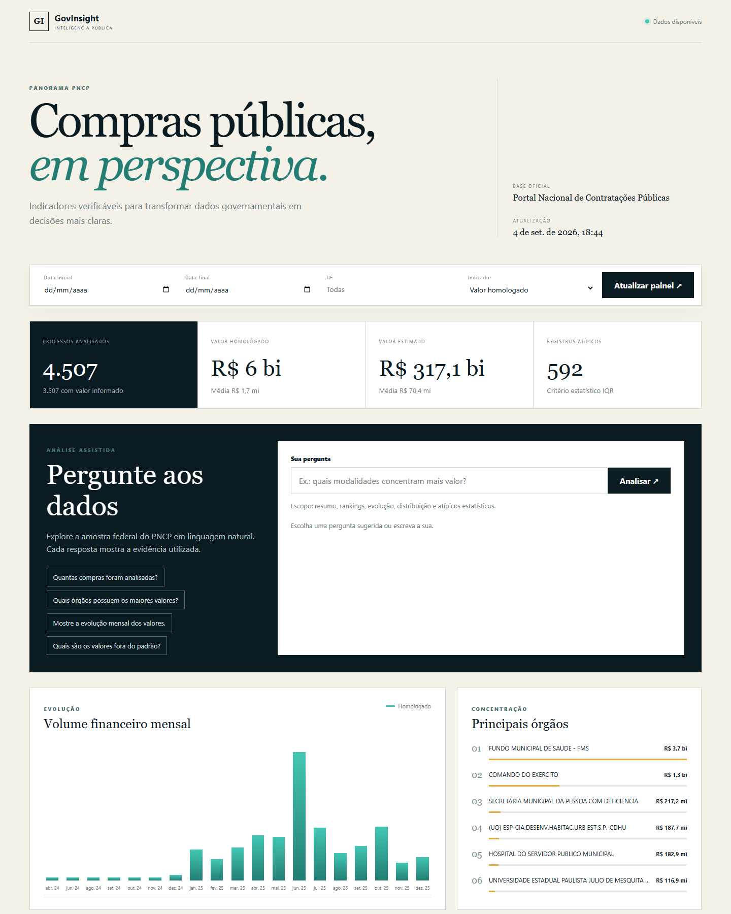
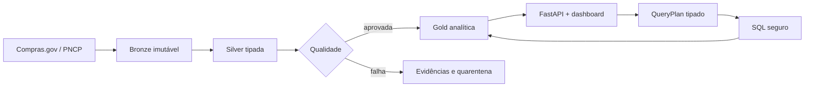

# GovInsight AI

**Dados oficiais de compras públicas transformados em indicadores verificáveis e respostas em linguagem natural.**

GovInsight AI é um produto de engenharia e análise de dados que percorre o caminho completo entre a
fonte governamental e uma decisão: ingestão idempotente, modelagem Bronze/Silver/Gold, qualidade,
API, dashboard responsivo e um fluxo de agentes que só publica respostas apoiadas por evidências.



> Status: produto local completo e preparado para publicação no GitHub, Neon e Vercel. A URL pública
> será adicionada após a criação autorizada das contas e recursos externos.

## Evidências rápidas

- **4.507 contratações oficiais** carregadas na demonstração local, sem CSV ou banco no Git.
- **19 meses de publicação** disponíveis no recorte federal da amostra.
- **30 casos versionados** no benchmark do agente, incluindo filtros e solicitações adversariais.
- SQL analítico **parametrizado, somente leitura, limitado a 200 linhas e 5 segundos**.
- Pipeline com reconciliação, linhagem, quarentena e bloqueio da Gold quando a qualidade falha.

## O que torna o projeto diferente

O visitante pode filtrar indicadores ou usar **Pergunte aos dados** para solicitar resumos, rankings,
tendências, distribuições e valores atípicos. A resposta inclui números preservados entre os agentes,
uma ressalva contra conclusões de fraude e a consulta usada como evidência.

O OpenAI Responses API é opcional. Quando habilitado, o modelo produz apenas um `QueryPlan` JSON
tipado; um compilador determinístico gera a consulta. Sem chave, o produto continua funcional com
o planejador baseado em regras e o mesmo contrato de segurança.



## Execute em poucos minutos

Requisitos: Docker com Docker Compose.

```powershell
docker compose up -d --build
Invoke-RestMethod http://localhost:8000/health
```

Abra:

- Dashboard: `http://localhost:8000/`
- Documentação interativa: `http://localhost:8000/docs`

Para carregar um export oficial já baixado e ignorado pelo Git:

```powershell
docker compose up -d postgres
$env:GOVINSIGHT_POSTGRES_HOST = "127.0.0.1"
.\.venv\Scripts\alembic.exe upgrade head
.\.venv\Scripts\python.exe -m govinsight.importers.pncp_csv data/pncp_sample.csv --limit 5000
```

## Arquitetura e decisões

- **Bronze:** resposta exata, identidade da requisição, hash e checkpoints recuperáveis.
- **Silver:** tipos e identificadores validados, versões mais novas e rejeições rastreáveis.
- **Qualidade:** completude, validade, unicidade, consistência e linhagem com watermark de aprovação.
- **Gold:** dimensões conformadas, fato de contratação e reconciliação monetária transacional.
- **Analytics:** KPIs, rankings, séries mensais, distribuição e método IQR.
- **Agentes:** analista de dados, estatística, negócio, qualidade, crítico e relatório executivo.
- **Produção:** FastAPI serverless no Vercel, PostgreSQL gerenciado no Neon e carga via GitHub Actions.

As escolhas e os limites estão detalhados em [arquitetura](docs/architecture.md),
[agentes](docs/agents.md), [dicionário de dados](docs/data_dictionary.md) e
[análise da fonte](docs/data_source_analysis.md).

## Segurança e confiabilidade

- O modelo nunca recebe credenciais nem produz SQL executável.
- Relações e identificadores vêm de listas fechadas; valores do usuário usam parâmetros.
- O executor aceita um único `SELECT` em views Gold aprovadas e abre transação somente leitura.
- As rotas de IA limitam tamanho, duração e frequência das solicitações.
- Segredos, exports CSV, dumps e arquivos `.env` permanecem fora do repositório.
- CI executa lint, formatação, cobertura mínima de 80%, benchmark, auditoria e build Docker.

## Dados e limitações

A demonstração usa uma amostra de compras federais do export oficial Compras.gov/PNCP de 2025,
obtido do [repositório oficial de dados](https://repositorio.dados.gov.br/seges/comprasgov/anual/2025/).
Ela serve para demonstrar a arquitetura e **não representa cobertura nacional completa**. Valores
atípicos são sinais estatísticos pelo método IQR; **não indicam fraude ou irregularidade**. Valores
estimados e homologados são mantidos separados, e valor homologado não é valor contratado.

## Desenvolvimento

```powershell
python -m venv .venv
.\.venv\Scripts\python.exe -m pip install -r requirements-dev.txt
.\.venv\Scripts\python.exe -m pytest -m "not live_api" --cov=govinsight
```

Configurações usam o prefixo `GOVINSIGHT_`; consulte [.env.example](.env.example). O modo padrão é
`GOVINSIGHT_AGENT_PROVIDER=rules`. Para OpenAI, configure também a chave e o modelo em um gerenciador
de segredos — nunca no código.

## Pontos para entrevista

- Por que um LLM gera um plano tipado em vez de SQL.
- Como watermarks e hashes tornam reprocessamento e retomada seguros.
- Como a reconciliação impede que uma Gold inconsistente seja publicada.
- Por que ETL fica fora do runtime serverless e usa uma conexão administrativa separada.
- Quais trade-offs permitem uma demonstração pública de baixo custo sem exagerar o escopo dos dados.

## Autoria

Projeto desenvolvido por **Sofia** — [sofiabns06@gmail.com](mailto:sofiabns06@gmail.com).

Licenciado sob a [MIT License](LICENSE).
