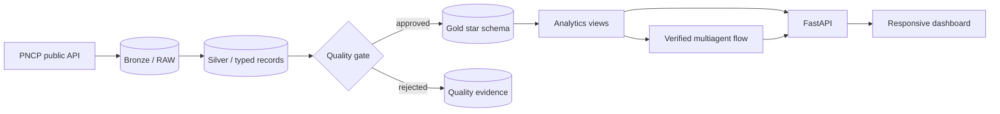

# GovInsight AI architecture

## System flow

## Data path

1. **Extraction** reads bounded, paginated procurement responses from the official PNCP API with
   retry and timeout policies.
2. **Bronze** stores the exact response text, request identity, hash and ingestion metadata. Identical
   replays are idempotent; changed source content creates a new immutable version.
3. **Silver** validates identifiers and types, upserts only newer source versions and quarantines bad
   records with reason codes.
4. **Quality** scores completeness, validity, uniqueness, consistency and lineage. A blocking failure
   prevents the trusted watermark from advancing.
5. **Gold** loads conformed date, organization, unit and modality dimensions plus a procurement fact
   inside one reconciled transaction.
6. **Analytics** exposes canonical views and typed services for KPIs, rankings, trends, distributions
   and IQR outliers.
7. **Delivery** serves the API, dashboard and evidence-backed agent reports from the same application.

## Reliability boundaries

- Extraction checkpoints resume an interrupted source query without rewriting prior RAW evidence.
- Silver, quality and Gold watermarks make every transition explicit and replayable.
- Gold only advances after a passing quality run for the exact Silver snapshot.
- Monetary values use exact decimal database types and estimated/homologated values remain separate.
- Agent SQL runs in read-only transactions, against an allow-list, with one statement, a row limit and
  a five-second timeout.
- The critic gate rejects executive output without data evidence or when numbers change between stages.

## Runtime

Docker Compose starts PostgreSQL 16 and the Python 3.12 API. Alembic migrations run before the API
process. The web dashboard is packaged with the Python application and served at `/dashboard/`.
GitHub Actions independently checks source quality, tests and the production image.
