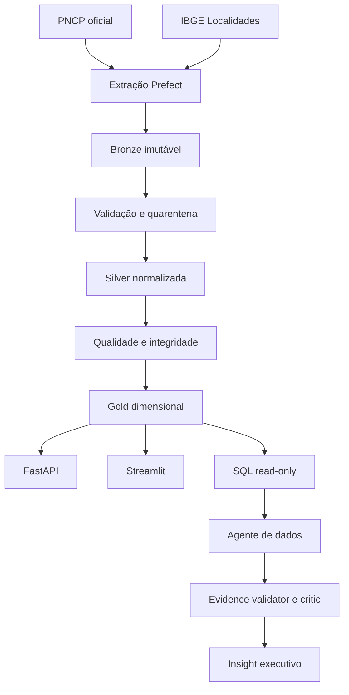

# GovInsight AI — Discovery e Arquitetura

**Fase:** 0 — Discovery e Architecture  
**Data da validação:** 17 de agosto de 2026  
**Status:** aprovado

## Resumo executivo

O PNCP disponibiliza APIs públicas adequadas ao núcleo do GovInsight AI. Consultas reais de
contratações, contratos e atualizações globais responderam com HTTP 200, paginação explícita
e identificadores naturais. A API de Localidades do IBGE também respondeu com HTTP 200 e
validou os códigos municipais presentes na amostra do PNCP.

A descoberta determinou que contratação, item, resultado do item e contrato/empenho possuem
grãos e valores diferentes. Por isso, o warehouse não usará uma única fato ambígua:

- contratação: valores estimado e homologado;
- item: quantidade, unidade e valores estimados;
- resultado: fornecedor e valores homologados por item;
- contrato/empenho: valores inicial, global e acumulado.

## Fontes oficiais

| Fonte | Uso | Referência |
|---|---|---|
| PNCP API Consulta | Publicação e atualização global | [Swagger](https://pncp.gov.br/api/consulta/swagger-ui/index.html) |
| PNCP OpenAPI | Parâmetros, paginação e schemas | [OpenAPI JSON](https://pncp.gov.br/api/consulta/v3/api-docs) |
| Manual PNCP v2.5 | Detalhe, itens, resultados e domínios | [Manual](https://pncp.gov.br/manual/pt-br/latest/) |
| IBGE Localidades | Município, UF e região | [Documentação](https://servicodados.ibge.gov.br/api/docs/localidades) |

As consultas utilizadas são públicas e não exigem credenciais. APIs de manutenção do PNCP
estão fora do escopo.

## Endpoints validados

Base de consulta: `https://pncp.gov.br/api/consulta`

| Endpoint | Estratégia |
|---|---|
| `/v1/contratacoes/publicacao` | Bootstrap e reconciliação |
| `/v1/contratacoes/atualizacao` | Incremental de contratações |
| `/v1/contratos` | Bootstrap de contratos |
| `/v1/contratos/atualizacao` | Incremental de contratos |
| `/v1/orgaos/{cnpj}/compras/{ano}/{sequencial}` | Detalhe pontual |

Endpoints públicos adicionais da base `https://pncp.gov.br/api/pncp`:

- `/v1/orgaos/{cnpj}/compras/{ano}/{sequencial}/itens`;
- `/v1/orgaos/{cnpj}/compras/{ano}/{sequencial}/itens/{numeroItem}/resultados`;
- `/v1/modalidades?statusAtivo=true`.

### Paginação confirmada

Contratações exigem `dataInicial`, `dataFinal`, `codigoModalidadeContratacao` e `pagina`.
`tamanhoPagina` aceita de 10 a 50. Contratos exigem as datas e a página, com tamanho de 10 a
500. Datas foram testadas no formato `YYYYMMDD`.

Resposta observada:

```json
{
  "data": [],
  "totalRegistros": 0,
  "totalPaginas": 0,
  "numeroPagina": 1,
  "paginasRestantes": 0,
  "empty": true
}
```

O OpenAPI declara 200, 204, 400, 401, 422 e 500. HTTP 204 será tratado como janela sem dados.

`codigoModalidadeContratacao` é obrigatório. A API de domínios retornou 19 modalidades
ativas no teste; o pipeline consultará esse domínio dinamicamente para não codificar IDs.

Não foi encontrado quota oficial nem header de rate limit. O cliente começará com defaults
operacionais configuráveis de duas requisições simultâneas e duas por segundo. Esses valores
pertencem ao GovInsight AI, não são limites atribuídos ao PNCP. HTTP 429 respeitará
`Retry-After` ou backoff exponencial com jitter.

## Evidências dos testes

| Consulta | Janela/filtro | Resultado |
|---|---|---|
| Contratações por publicação | 01/08/2025, modalidade 6 | HTTP 200; 1.737 registros |
| Contratações por atualização | 01/08/2025, modalidade 6 | HTTP 200; 1.219 registros |
| Contratos por publicação | 01/08/2025 | HTTP 200; 8.461 registros |
| Contratos por atualização | 01/08/2025 | HTTP 200; 7.781 registros |
| Detalhe de contratação | CNPJ 83551549000100, 2025/27 | HTTP 200 |
| Itens | mesma contratação | HTTP 200; 6 itens |
| Resultado do item 1 | mesma contratação | HTTP 200 |
| IBGE município 3550308 | São Paulo | HTTP 200 |
| Lista IBGE | Brasil | HTTP 200; 5.571 municípios |

Os totais representam somente a janela e os filtros indicados; não foram extrapolados.

Um teste inicial com `tamanhoPagina=5` recebeu HTTP 400. O OpenAPI revelou mínimo 10; após a
correção, a mesma classe de consulta respondeu HTTP 200.

## Perfil inicial de qualidade

Foram perfiladas 50 contratações da modalidade 6 e 50 contratos publicados em 01/08/2025.

| Regra | Resultado |
|---|---:|
| IDs duplicados | 0/100 |
| Objeto ausente | 0/100 |
| Código IBGE ausente | 0/100 |
| Código IBGE sem correspondência | 0/100 |
| Valor principal negativo | 0/100 |
| Data final anterior à inicial | 0/100 |
| Valor homologado ausente em contratações | 8/50 |
| Fornecedor ausente em contratos | 0/50 |

`valorTotalHomologado` é nullable durante o ciclo de vida e não será substituído por zero. O
OpenAPI não marca os campos de negócio como obrigatórios; a Bronze aceitará o payload antes de
as regras empíricas da Silver decidirem validade.

## Incremental e idempotência

### Bootstrap

1. Atualizar modalidades ativas.
2. Abrir janelas diárias por modalidade para publicações de contratações.
3. Abrir janelas diárias para publicações de contratos.
4. Persistir a resposta RAW antes de transformar.
5. Retomar por dataset, modalidade, data e página.

### Operação contínua

1. Consumir os endpoints de atualização global.
2. Reabrir dois dias a partir do último sucesso para correções tardias.
3. Fazer UPSERT pela chave natural somente quando o hash normalizado mudar.
4. Avançar o watermark após Silver/Gold e regras críticas passarem.
5. Executar reconciliação periódica pelos endpoints de publicação.

Chaves naturais:

- contratação: `numeroControlePNCP`;
- contrato: `numeroControlePNCP`;
- item: `(numeroControlePNCPCompra, numeroItem)`;
- resultado: `(numeroControlePNCPCompra, numeroItem, sequencialResultado)`;
- órgão: CNPJ;
- unidade: `(cnpj_orgao, codigoUnidade)`;
- localidade: código IBGE.

## Modelo inicial

### Bronze

`bronze.raw_api_response` preservará fonte, endpoint, parâmetros, janela, página, status HTTP,
corpo textual exato, SHA-256, contagem, instante UTC e duração. O corpo será `text`, não apenas
JSONB, para preservar exatamente o conteúdo recebido.

### Silver

- `silver.procurement`;
- `silver.contract`;
- `silver.procurement_item`;
- `silver.item_result`;
- `silver.ibge_location`;
- `silver.rejected_record`;
- `control.etl_run` e `control.etl_watermark`.

Valores monetários usarão `numeric`, nunca `float`. Datas sem offset serão preservadas no RAW;
nenhuma zona será inventada silenciosamente.

### Gold

Dimensões: data, órgão, unidade, localidade, fornecedor, modalidade e categoria versionada.

Fatos:

- `gold.fact_procurement`: uma contratação;
- `gold.fact_contract`: um contrato/empenho;
- `gold.fact_procurement_item`: um item;
- `gold.fact_item_result`: um resultado por item/fornecedor.

“Total contratado” usará `fact_contract.valor_global`. Valor homologado não será usado como
substituto de contrato.

## Arquitetura recomendada



Escolhas: Python 3.12, PostgreSQL, Prefect, Pandas em chunks, SQL/Python versionados, FastAPI,
Streamlit e interface independente de LLM. Airflow, dbt, MinIO e LangGraph foram removidos do
primeiro vertical slice. LangGraph será reavaliado quando branching e ciclos de crítica forem
necessários.

## IA e segurança

Cálculos, anomalias, qualidade, confidence score e evidence coverage serão determinísticos.
LLMs atuarão em tradução de intenção, interpretação e narrativa. Todo número deverá apontar
para query, coluna/agregado, período e snapshot. SQL aceitará somente uma statement
`SELECT`/`WITH`, com parser, allowlist, timeout, limite de linhas e usuário PostgreSQL somente
leitura.

Identificadores de fornecedor pessoa física serão mascarados nas views públicas. Texto vindo
do PNCP será tratado como dado não confiável, nunca como instrução para agentes.

## Principais riscos

| Risco | Mitigação |
|---|---|
| Schema drift | parsing tolerante na Bronze e alerta de contrato |
| Modalidades novas | domínio consultado em cada ciclo |
| Quota não publicada | throttle configurável, retry e jitter |
| Volume diário alto | janelas, páginas máximas e batch UPSERT |
| Fan-out de itens/resultados | expansão somente após medição |
| Atualizações tardias | endpoint de atualização, overlap e reconciliação |
| Semântica de valores | fatos e catálogo de métricas separados |
| CPF em fornecedor | RBAC, mascaramento e views autorizadas |
| Hallucination | evidence ledger, reconciliação e bloqueio pelo critic |

## Revisão crítica

A arquitetura mantém apenas componentes necessários ao vertical slice. As análises de órgão,
região, modalidade, fornecedor, valor e tempo são suportadas. Categorias de tecnologia serão
classificações derivadas e versionadas. Concentração e anomalia não serão apresentadas como
fraude. O Opportunity Score será descritivo e determinístico, não previsão inventada por LLM.

```text
DISCOVERY_STATUS = PASSED
```

