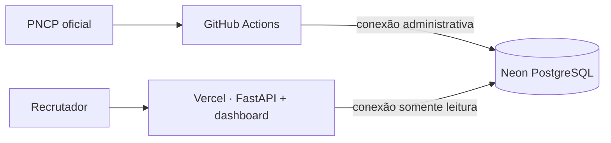

# Publicação gratuita: GitHub, Neon e Vercel

O GovInsight AI separa aplicação e processamento para caber nos planos gratuitos sem executar uma
carga de dados longa dentro de uma requisição web.

## 1. Publicar no GitHub

Crie um repositório público e envie a branch estável. O arquivo `app.py` na raiz é o ponto de
entrada reconhecido pelo Vercel. Não envie `.env`, CSVs, dumps ou credenciais.

## 2. Criar o banco gratuito no Neon

Crie um projeto PostgreSQL e mantenha duas conexões:

- **administrativa direta:** usada apenas pelas cargas e migrações no GitHub Actions;
- **pooled somente leitura:** usada pela aplicação no Vercel.

As duas URLs precisam exigir SSL. A aplicação aceita `sslmode=require` ou `sslmode=verify-full`.

## 3. Configurar os segredos do GitHub

Em **Settings → Secrets and variables → Actions**, cadastre:

| Nome | Valor |
|---|---|
| `GOVINSIGHT_DATABASE_ADMIN_DSN` | URL administrativa direta do Neon com SSL |

Execute uma vez o workflow **Load official demo data**. Ele aplica as migrações e carrega uma
amostra do snapshot anual oficial mais recente, atualmente 2026. Depois, execute **Sync recent PNCP
data** para validar a consulta incremental. Esse segundo workflow também roda semanalmente.

## 4. Publicar no Vercel

Importe o repositório pelo painel do Vercel. O FastAPI é detectado automaticamente pelo `app.py` e
pela dependência registrada no projeto. Não defina framework, build command ou output directory.

Cadastre estas variáveis nos ambientes Production e Preview:

| Nome | Valor |
|---|---|
| `GOVINSIGHT_APP_ENV` | `production` |
| `GOVINSIGHT_DATABASE_DSN` | URL pooled somente leitura do Neon com SSL |
| `GOVINSIGHT_AGENT_PROVIDER` | `rules` |

O modo `rules` não exige chave nem serviço pago. A integração opcional com OpenAI deve permanecer
desativada enquanto uma chave não for deliberadamente configurada.

## 5. Validar a publicação

Confira, nesta ordem:

1. `/health` responde com status saudável;
2. `/analytics/summary` retorna contagens maiores que zero;
3. `/dashboard/` mostra **Dados disponíveis**;
4. uma pergunta livre retorna números e evidência;
5. o workflow incremental termina sem falhar na etapa de qualidade.

## Operação sem custo desnecessário

- O Vercel serve o painel e consultas curtas; não executa ETL.
- O GitHub Actions faz uma atualização semanal com sobreposição de sete dias.
- O banco recebe UPSERTs idempotentes e não duplica uma contratação reprocessada.
- Repositórios públicos sem atividade por 60 dias podem ter workflows agendados desativados pelo
  GitHub; uma execução manual os reativa quando necessário.
