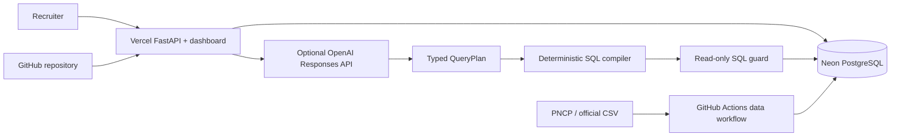

# GovInsight AI — Portfolio Production Design

## Objective

Turn the validated local product into a public, recruiter-ready portfolio application with a live
demo, visible natural-language analytics, optional real LLM interpretation, managed data, production
security controls and polished GitHub presentation.

## Success criteria

- A recruiter reaches the live dashboard from the repository in one click.
- The first viewport communicates the business problem, real dataset scope and principal metrics.
- A visitor can ask supported questions and receive a concise report with numbers and evidence.
- The app remains useful without an LLM key through the deterministic baseline.
- When enabled, the LLM emits a typed query plan rather than executable SQL.
- Every query remains parameterized, read-only, allow-listed, row-limited and time-limited.
- Production uses a managed PostgreSQL database populated with the official demonstration dataset.
- CI, security checks, documentation, screenshot, repository metadata and a `v1.0.0` release are ready.

## Architecture



Vercel hosts the existing FastAPI application and its packaged static dashboard in one deployment,
avoiding CORS and a second frontend project. Neon supplies PostgreSQL. The web application uses a
pooled read-only connection; migrations and ingestion use a separate direct administrative
connection only inside GitHub Actions. Long-running extraction never executes inside an HTTP request.

## Natural-language analysis

The current keyword baseline remains the default and fallback. A new `OpenAIQueryPlanner` uses the
Responses API with Structured Outputs to produce this closed contract:

```json
{
  "intent": "summary | ranking | monthly_trend | distribution | outliers",
  "dimension": "organization | state | modality | null",
  "measure": "estimated | homologated",
  "start_date": "YYYY-MM-DD | null",
  "end_date": "YYYY-MM-DD | null",
  "uf": "UF | null",
  "limit": 10
}
```

The model receives metric definitions and supported filters, but no credentials and no database
contents. A deterministic compiler maps `QueryPlan` to parameterized SQL. Unsupported requests are
returned as a structured refusal. The existing SQL guard remains the final execution boundary.
OpenAI is disabled unless `GOVINSIGHT_AGENT_PROVIDER=openai`, `GOVINSIGHT_OPENAI_API_KEY` and
`GOVINSIGHT_OPENAI_MODEL` are configured. Failures fall back to rules and are recorded without prompt
or secret leakage.

## Dashboard experience

Add a prominent “Pergunte aos dados” section below the KPIs. It contains four example prompts, one
text field, submit/cancel controls, a bounded loading state and an accessible result region. The
answer presents executive summary, key numbers, trends, attention points and a collapsible evidence
panel with source view, row count and SQL. The UI must explicitly label IQR outliers as statistical,
not evidence of fraud.

The first README screen receives a real screenshot of this dashboard, a one-line value proposition,
verified metrics, CI status and direct demo/API links. Detailed operations move behind links to the
existing documents so the README becomes easier to scan without losing depth.

## Production data

The public demo uses the existing 4,507-record official federal procurement sample. Its source,
retrieval date, period coverage and limitation are visible in the dashboard and README. No dataset is
committed to Git. A manual GitHub Actions workflow downloads a bounded official export, verifies the
source response, runs Alembic, imports the rows and checks Gold reconciliation. A scheduled workflow
may refresh the sample weekly only after the manual production run is stable.

## Deployment and security

- Root `app.py` exports the FastAPI `app` for Vercel discovery.
- Production database credentials exist only in Vercel and GitHub encrypted secrets.
- The Vercel runtime receives a pooled read-only Neon URL; ETL receives a direct writer URL.
- Startup does not run migrations in the request-serving process.
- AI endpoints enforce body limits, timeout, safe error messages and a bounded request rate.
- GitHub Actions runs Ruff, the complete PostgreSQL suite, coverage, dependency audit and Docker build.
- Dependabot monitors Python and GitHub Actions dependencies.
- `.env`, downloaded CSV files, database dumps and generated credentials remain ignored.

## Repository presentation

The repository will use `main` as its default release branch, MIT license, a meaningful description,
demo homepage, up to 12 focused topics, CI badge, social preview image and a `v1.0.0` release. The
README will state that the current agent baseline is deterministic and that OpenAI is optional. No
claim will imply nationwide PNCP coverage or fraud detection.

## Testing and release gate

- Unit tests validate QueryPlan schemas, compiler mappings, injection rejection, fallback and UI API
  response states.
- Agent benchmark expands to supported/unsupported questions, filters, prompt injection and numeric
  grounding; existing 100% accuracy and grounded-answer targets remain gates for the fixed benchmark.
- Integration tests run against PostgreSQL and verify read-only credentials.
- A production smoke test checks `/health`, `/dashboard/`, analytics, agent report and evidence.
- Desktop and mobile screenshots are visually reviewed once, after the implementation stabilizes.

## Out of scope

- Nationwide full-history PNCP warehousing in the free portfolio environment.
- User accounts, saved conversations or unlimited agent memory.
- Autonomous agent writes, arbitrary SQL and causal or fraud conclusions.
- Kubernetes, Kafka, a vector database or a second frontend framework.
